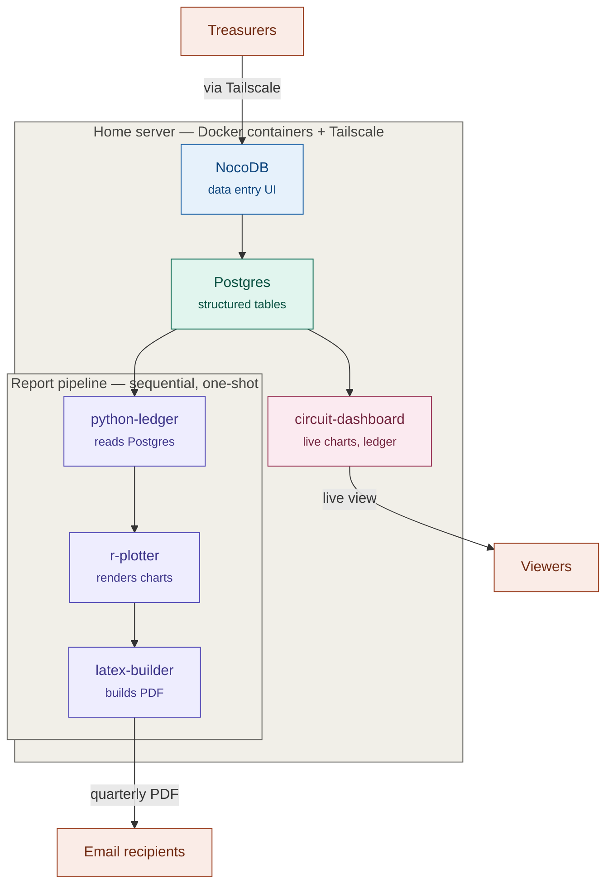

# Circuit finance architecture — v2 (containerized)

Reflects the actual current stack: Docker containers for NocoDB, the three-stage report
pipeline, and the Shiny dashboard. Paste into `docs/architecture.md`.

## What changed from v1

- **NocoDB** now runs as its own container (`circuit_nocodb`), talking to Postgres over
  `host.docker.internal`.
- **Report script** is now three chained one-shot containers, not one script — python-ledger
  exports data, r-plotter renders charts from it, latex-builder assembles the final PDF.
  Run sequentially via a shell script, not `docker compose up` together, since each stage
  depends on the previous one's output.
- **Shiny dashboard** (`circuit-dashboard`) is new — reads Postgres independently of the
  report pipeline, serving a live, always-available view rather than a scheduled snapshot.
- **Tailscale Serve** fronts multiple services now (NocoDB, the dashboard) with clean paths
  under one hostname, rather than raw IP:port per service.
