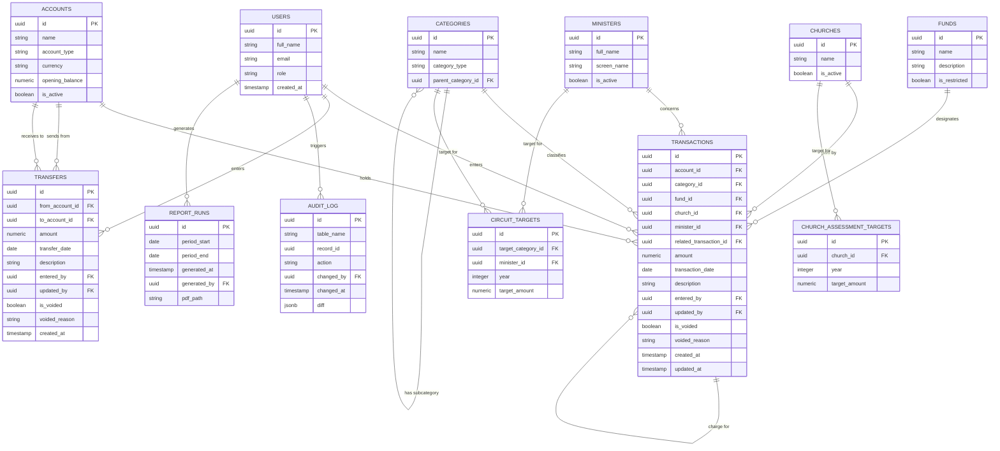

# Circuit Finance Database

This document describes the Postgres schema used to track church income, expenses, and generate the monthly financial report. It's meant to be read alongside `schema.sql`, which is the actual source of truth for table definitions.

## Overview

The database replaces the old single Excel sheet with a small set of normalized tables. Treasurers enter data through a browser UI (NocoDB) that writes directly into these tables; a scheduled Python script reads from them each month to generate the PDF report.

There are two accounts in practice: the church **bank account**, and **petty cash / M-Pesa**, which are tracked together as one account. Money is either:

- **Income or expense** — recorded in `transactions`, always tied to one account, one category, and optionally one fund.
- **A transfer** — money moving between the bank and petty cash/M-Pesa, recorded in `transfers`. Transfers are not income or expense and never appear in the income/expense report.

## Schema



TODO: To update the tables decription.

## Tables

### `users`

The treasurers and other people who can log in. Every entry in `transactions`, `transfers`, and `audit_log` is tied back to a user, so it's always clear who entered or changed what. `role` distinguishes admins (who can manage accounts/categories) from regular treasurers (who enter data) from viewers (read-only).

### `accounts`

The physical places money sits — Bank and Petty cash/M-Pesa. In practice this table will only ever have two active rows; it exists as a table rather than a hardcoded constant so the schema doesn't need to change if that ever grows.

### `funds`

What pool of money a transaction belongs to, separate from what kind of transaction it is. Most entries belong to the "General Fund." `is_restricted` flags money that can only be spent on a specific purpose (e.g. a building fund or a missions appeal), so restricted giving doesn't get accidentally spent on general running costs.

### `categories`

The nature of a transaction — tithe, offering, utilities, salaries, and so on. `category_type` is either `income` or `expense`, which determines whether a transaction adds to or subtracts from an account's balance. `parent_category_id` allows subcategories (e.g. "Offering" as a parent of "Sunday offering" and "Thanksgiving offering") without needing a rigid fixed list.

### `transactions`

The core table — one row per income or expense entry. `amount` is always stored as a positive number; whether it adds to or subtracts from the balance comes from the linked category's `category_type`, not the sign of the number. This avoids the common mistake of someone entering an expense as a negative value inconsistently. Each row records `account_id`, `category_id`, an optional `fund_id`, and `entered_by`.

### `transfers`

Money moving between the two accounts — for example, withdrawing cash from the bank to top up petty cash, or depositing M-Pesa collections into the bank. Kept deliberately separate from `transactions` so transfers never need a fake category and never leak into income/expense totals. A transfer only ever affects account balances, not fund or category totals.

### `audit_log`

A generic change history, shared across tables rather than one audit table per table. Each row records which table and record changed, what kind of change it was (`INSERT`/`UPDATE`/`DELETE`), who made it, and a JSON diff of what changed. Populated automatically via Postgres triggers on the tables that matter (primarily `transactions`).

### `report_runs`

A record of every monthly report that's been generated — the period it covers, when it was generated, who/what generated it, and where the PDF was saved. This lets the report script check "has this period already been reported?" before regenerating, and gives a paper trail of what was sent and when.

## How data moves

1. A treasurer opens the NocoDB browser UI (reachable over Tailscale) and adds an income or expense entry, or a transfer between accounts.
2. The entry lands directly in `transactions` or `transfers` in Postgres. A trigger records the change in `audit_log`.
3. On the first Friday of the month, a scheduled script on the home server queries Postgres — pulling transactions, transfers, and the `account_balances` view — and builds the LaTeX report.
4. The script writes a row to `report_runs`, emails the PDF to the relevant people, and exits.

## Account balances

Rather than every part of the system recomputing a running balance, there's an `account_balances` view that does it once:

```
current_balance = opening_balance
                 + Σ(transactions where category_type = 'income')
                 − Σ(transactions where category_type = 'expense')
                 + Σ(transfers into the account)
                 − Σ(transfers out of the account)
```

Both the report script and any dashboard in NocoDB should read from this view rather than recalculating the formula themselves, so there's exactly one definition of "balance" in the whole system.

## Design notes

- **Funds vs. categories** are kept separate because they answer different questions: a category says *what kind* of transaction this is (utilities, tithe), a fund says *what pool of money* it belongs to (general, building). A single transaction has exactly one of each.
- **Amounts are always positive.** Direction is derived from the category, not the sign of the number, which removes a whole class of data-entry errors.
- **Audit logging is generic** (one `audit_log` table with `table_name` + `record_id`) rather than a bespoke audit table per entity, since the system is small enough that a single table is easier to reason about and query.
- **Transfers are not transactions.** This is the most important modeling decision in the schema — it keeps the income/expense report honest by construction, rather than relying on someone remembering to filter out a "Transfer" category every time.
